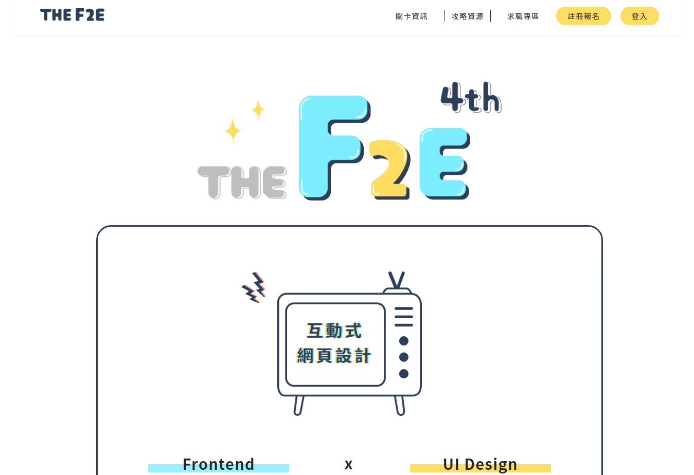

# 2022 F2E W1 - The F2E 活動網站設計

UI 設計 - <a href="https://2022.thef2e.com/users/12061549261449691931" target="_blank">Jamie</a>

設計稿 - <a href="https://www.figma.com/file/hkVKcjTvPsdWIR4whZ2yzD/The-F2E?node-id=0%3A1">Figma</a>

Demo - <a href="https://yuwen-ctw.github.io/2022_F2E_W1/">The F2E 活動網站設計</a>
 
 
## 使用方式
1. 打開終端機，Clone專案至本機
<pre><code>git clone https://github.com/Yuwen-ctw/2022_F2E_W1.git</code></pre>
2. 進入資料夾，並開啟 index.html
 
 

## 資料夾說明
+ ./src/image - 圖片放置處
+ ./src/scss - 樣式放置處

## 相關技術
+ GSAP - 滾動效果
+ lodash - throttle

## 開發工具
+ SCSS
+ Webpack
+ ESLint